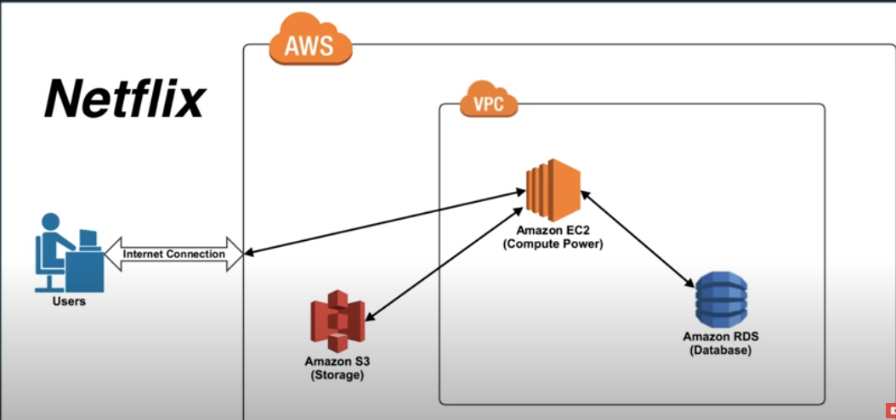
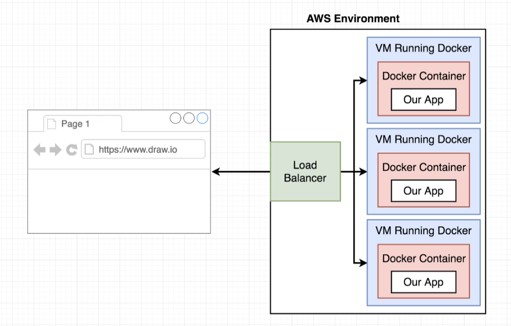
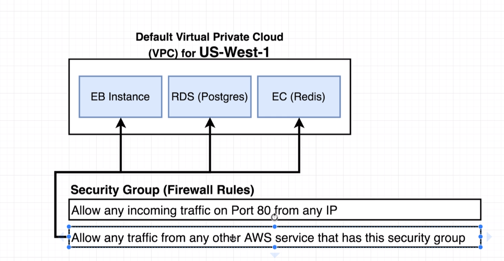
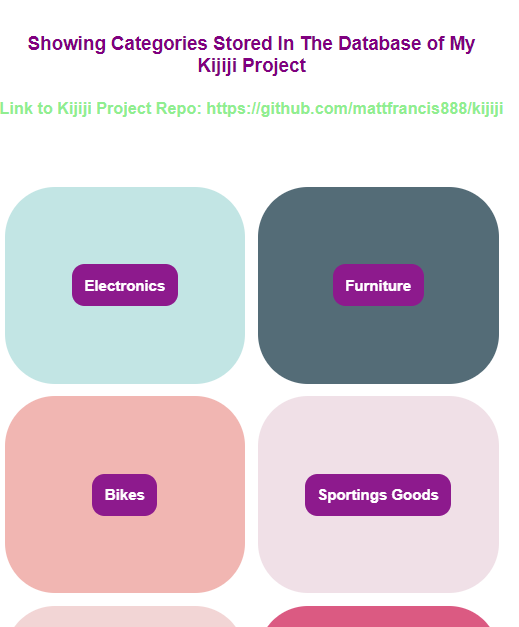

# multi-docker

A single-page app that shows the categories available (stored in PostgreSQL) from a previous project, Kijiji. Built to understand Docker, AWS infrastructure (eg: EC2, S3, RDS, VPS, Security Groups, etc), the deployment process to AWS Elastic Beanstalk, and CI/CD flow.

**Note: The app is now deployed at Vercel because of the cost of running an AWS server.**

# Why I Built It And What I've Learned:

-   To understand what and why we use Docker.
-   To understand how Docker is used in development and production.
-   To understand AWS's infrastructure for website deployments.
-   To understand CI/CD. TravisCI was used here.

## Docker And AWS Beanstalk flow:

In my Dockerfile, I used nginx as my production server. I pushed my images to Docker Hub. AWS would then get the images from Docker Hub and serve it up.

### Why we use Docker?

Docker facilitates installing and executing dependencies associated with a project for any given computer. This prevents scenarios where our installation would fail after cloning a remote repository to a computer.

### Docker Compose

For development, Docker Compose is a tool for defining and running multi-container Docker applications/Dockerfiles.

Note for me:

-   When running `docker-compose up` make sure you are at the directory where the `docker-compose` file is. Otherwise, it will still execute but other Dockerfiles will not be executed.
-   Refer to `docker commands` file in your google drive for a list of commands for Docker.

## AWS

### Diagram of AWS's infrastructure:



#### EC2 - Elastic Compute Cloud:

EC2 is Amazon's service that allows you to create a server (AWS calls these instances) in the AWS cloud. You pay by the hour and only what you use. You can do whatever you want with this instance as well as launch n number of instances. flexible.

### AWS's Storage Options

#### RDS - Relational Database Service:

Web service that's maintained by AWS engineers to simplify the setup, operation, and scaling of a database for use in applications. In essence, we allow AWS to "handle" our database; we have less control of our database.

#### Amazon S3:

Provides object storage through a web service interface. Amazon RDS enables you to run a fully-featured relational database while offloading database administration. Whereas, for more control and flexibility, EC2 will be better for your relational database.

### Elastic Beanstalk:

Elastic Beanstalk is one layer of abstraction away from the EC2 layer. Elastic Beanstalk will setup an "environment" for you that can contain a number of EC2 instances, an optional database, as well as a few other AWS components such as a **Elastic Load Balancer, Auto-Scaling Group, Security Group**. Then Elastic Beanstalk will manage these items for you whenever you want to update your software running in AWS. Elastic Beanstalk doesn't add any cost on top of these resources that it creates for you. If you have 10 hours of EC2 usage, then all you pay is 10 compute hours.

### Load Balancers:

Elastic Load Balancing automatically distributes incoming application traffic across multiple targets, such as Amazon EC2 instances, containers, IP addresses, Lambda functions, and virtual appliances.

Since our project is 'dockerized', the load balancer would create new containers automatically to distribute user traffic.



Note: We don't have to use Elastic Beanstalk to enable load balancing. If we only have an ES2 running, the load balancers are the same, but Beanstalk manages the configuration for us. If we want to roll our own infrastructure, we'll need to manually configure a load balancer, add rules to route traffic to our EC2 instances, etc.

### Diagram of VPC and Security Groups:



### VPC - Virtual Private Cloud:

Our Private build network. Any instance/services that we create is in our `VPC`/associated with only our account.

### Security Groups

Essentially are 'firewall rules'. Rule(s) that describe what services can connect to our services running in our VPC. In the diagram below, the RDS and EC can talk to each other because of our Security group configuration.

## Production

### Nginx

Acts as a production server to take incoming request / handle our React application code in production. Nginx is also used as a development server.

### Images in Dockerhub

After the commit passes TravisCI, we push our images to Docker Hub. Elastic Beanstalk will use the images in Docker Hub with `Dockerrun.aws.json`.

## What It Looks Like



# Getting Started

These instructions will get you a copy of the project up and running on your local machine for development and testing purposes.

1. Clone the project. Change the Axios call that's supposed to be used for development in `App.js`. Use `docker-compose up --build`.

# Prerequisites

What things you need to install the software

```
- Any package manager (npm, yarn)
```

# Versioning

None
